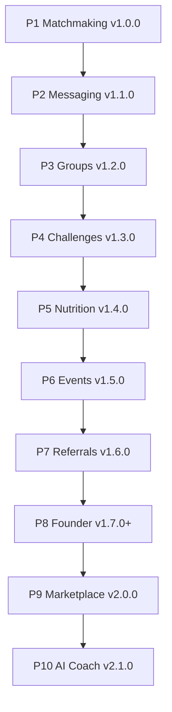

# Frennix Product Roadmap

**Status:** Official — approved direction, pending per-milestone start approval  
**Last updated:** June 2025  
**Owner:** Founder  
**Source of truth:** [`PRODUCT-VISION.md`](./PRODUCT-VISION.md) — all features must align  
**Long-term goal:** Build Frennix into a world-class fitness social platform that scales from beta to millions of users.

---

## How to use this document

1. **Product Vision first** — Every feature must align with [`PRODUCT-VISION.md`](./PRODUCT-VISION.md). Misaligned proposals are questioned before development.
2. **No milestone begins without explicit founder approval** (reply e.g. *“Approved — begin P1”*).
2. **No commits, release tags, pushes, or production deployments** without separate explicit approval per [Release Workflow](./releases/RELEASE-WORKFLOW.md).
3. Each phase ends with a **Review Checkpoint** (like M7.1–M7.3) before the next phase starts.
4. **Founder Dashboard (P8)** is paused after M7.3 until P1–P7 progress; it remains fully functional and receives maintenance-only fixes until then.
5. Every feature is designed for **scalability, maintainability, performance, security, and exceptional UX**.
6. **Release Checklist required** — Every milestone (P1–P10) must complete [`RELEASE-CHECKLIST.md`](./RELEASE-CHECKLIST.md) before considered finished.
7. **Progress tracking** — Live status in [`PROJECT-PROGRESS.md`](./PROJECT-PROGRESS.md) (updated after every milestone).
8. **Four perspectives** — Every milestone evaluated through UX, Business Growth, Founder Operations, and Scalability per [`MILESTONE-FRAMEWORK.md`](./MILESTONE-FRAMEWORK.md). Detail in [`MILESTONE-PERSPECTIVES.md`](./MILESTONE-PERSPECTIVES.md).

### Release Checklist (required to finish any milestone)

Every P1–P10 milestone must complete all 18 items in [`RELEASE-CHECKLIST.md`](./RELEASE-CHECKLIST.md). Milestone-specific copies live under each feature folder (e.g. [`matching/P1-RELEASE-CHECKLIST.md`](./matching/P1-RELEASE-CHECKLIST.md)).

### Standard deliverables (every milestone)

Each phase **must** produce:

| Deliverable | Description |
|-------------|-------------|
| **Architecture review** | Design doc, data flow, security model, scale notes |
| **Database changes** | Migrations, RLS, indexes, rollback SQL |
| **API changes** | RPCs, client packages, types, Realtime patterns |
| **UI/UX polish** | Mobile-first, safe areas, accessibility, empty/loading/error states |
| **QA checklist** | Automated scripts + pass/fail criteria |
| **Manual testing checklist** | iOS, Android, Web sign-off matrix |
| **Analytics instrumentation** | `product_events`, founder metrics hooks where applicable |
| **Success metrics** | Measurable targets for launch + 30 days |
| **Release notes** | `CHANGELOG.md` + `features/releases/RELEASE-vX.Y.Z.md` |
| **Rollback plan** | Feature flags, migration rollback, comms |
| **Production readiness review** | Sign-off template before deploy |
| **Release Checklist** | All 18 items in [`RELEASE-CHECKLIST.md`](./RELEASE-CHECKLIST.md) |
| **Four perspectives** | UX · Growth · Founder Ops · Scalability ([`MILESTONE-FRAMEWORK.md`](./MILESTONE-FRAMEWORK.md)) |

---

## Roadmap at a glance

| Phase | Name | Target version | Est. duration | Completion | Status |
|-------|------|----------------|---------------|------------|--------|
| **P1** | Matchmaking (Production Ready) | **v1.0.0** | 3–4 weeks | **90%** | **In progress** |
| **P2** | Messaging | v1.1.0 | 3–4 weeks | 78% | Planned |
| **P3** | Groups & Communities | v1.2.0 | 6–8 weeks | 35% | Planned |
| **P4** | Challenges | v1.3.0 | 4–5 weeks | 62% | Planned |
| **P5** | Nutrition | v1.4.0 | 6–8 weeks | 5% | Planned |
| **P6** | Events | v1.5.0 | 4–5 weeks | 68% | Planned |
| **P7** | Referral & Ambassador Program | v1.6.0 | 5–6 weeks | 38% | Planned |
| **P8** | Founder Dashboard (expand) | v1.7.0+ | 2–3 wk/slice | 55% | Paused (M7.3 done) |
| **P9** | Marketplace | v2.0.0 | 10–14 weeks | 8% | Planned |
| **P10** | AI Coach | v2.1.0 | 10–14 weeks | 0% | Planned |

**Sequential estimate (P1→P10):** ~14–18 months  
**Critical path:** P1 → P2 → P3 → P4; P5/P6 can partially overlap; P7 depends on referral foundation; P9 depends on payments infra.

---

## P1 — Matchmaking (Production Ready)

**Target version:** v1.0.0  
**Theme:** *Training Partners GA — the core Frennix experience*  
**Estimated duration:** 3–4 weeks  
**Current completion:** **90%**  
**Dependencies:** M2 Messaging stability (v0.8.0 Realtime fix shipped)  
**Four perspectives:** [`matching/P1-MILESTONE.md`](./matching/P1-MILESTONE.md) · [`MILESTONE-PERSPECTIVES.md`](./MILESTONE-PERSPECTIVES.md#p1--matchmaking--in-progress)

### Scope

- Complete matching experience (discovery → connect → match → chat)
- Smart filters (gender, partner preference, activities, goals, location)
- Profile compatibility scoring (Phase A scoring exists — polish + explain in UI)
- Discovery improvements (deck UX, empty states, refresh, gate incomplete profiles)
- Safety and reporting (block, report, ban enforcement in candidate RPCs)
- Human QA (complete `features/matching/QA.md`)
- Privacy review (update `frennix.app/privacy` per `features/matching/SECURITY.md`)
- Production readiness (pg_cron presence, Sentry tags, load test)

### Architecture review

| Area | Notes |
|------|-------|
| Discovery | `get_match_candidates` RPC, bidirectional filters, block list |
| Matching | `match_swipes`, mutual connect → `matches` row + notifications |
| Chat bridge | Reuse DM conversation creation from match list |
| Presence | `set_presence`, stale cleanup cron |
| Realtime | Separate topics per channel (v0.8.0 pattern) |
| Scale | Candidate RPC indexed; cap deck size; no full-table scans from client |

### Database changes

- Verify migrations through `20250630000014_matching_scoring_phase_a.sql` applied
- RLS: `match_swipes` SELECT-only (writes via RPC)
- Optional: compatibility score materialized hints table (if UI needs caching)

### API changes

- Polish `packages/api/src/matching.ts`, scoring helpers
- Sentry domain tags on all match RPC failures
- No breaking changes to match/message contracts

### UI/UX polish

- Discover tab → Training Partners deck
- Match list unread badges, online status, remove match flow
- Onboarding gate for incomplete profiles
- Fitness networking language (not dating) audit

### QA checklist

- Automated: `npx tsx scripts/verify-matchmaking-qa.ts` → PASS
- MM-01 through MM-09, ML-01 through ML-07, NT/PU/PR suites in `features/matching/QA.md`

### Manual testing checklist

- Two-account runbook on iOS, Android, Web
- Sign-off log in QA.md with tester name + date

### Analytics instrumentation

- `daily_active_user`, match swipe events, mutual match conversion
- Founder Dashboard: match activity triggers (already wired M7.2)

### Success metrics (30 days post-launch)

| Metric | Target |
|--------|--------|
| Match conversion (connect → mutual) | ≥ 15% of connects |
| Day-7 retention (matchers) | ≥ 40% |
| P0 matchmaking bugs | 0 |
| Push delivery (match notif) | ≥ 90% |

### Release notes

- `features/releases/RELEASE-v1.0.0.md`
- Highlight: Training Partners production-ready

### Rollback plan

- Feature flag `training_matchmaking` → disable discovery globally
- No data deletion; matches/messages preserved
- Revert deploy only if client regression; RPC issues fixable server-side

### Production readiness review

- [ ] Automated QA PASS  
- [ ] Human device QA signed off  
- [ ] Privacy policy updated  
- [ ] pg_cron `expire-stale-presence` confirmed  
- [ ] Founder approval to commit → tag → deploy  

### Risks

| Risk | Mitigation |
|------|------------|
| Realtime edge cases | v0.8.0 defensive patterns; monitor Sentry |
| Low candidate pool in beta | Seed testers; geo-agnostic filters |
| Privacy compliance | External policy update before GA |

### Future enhancements (post-P1)

- Trainer matching (Phase 14 — separate track)
- Video intros, verified athletes
- ML-based compatibility ranking at scale

---

## P2 — Messaging

**Target version:** v1.1.0  
**Theme:** *Messaging excellence — stable, expressive, fast*  
**Estimated duration:** 3–4 weeks  
**Current completion:** **78%**  
**Dependencies:** **P1** (match → chat flow stable); v0.8.0 Realtime foundation

### Scope

- Continue improving stability (channel lifecycle, reconnect, error banners)
- Emoji reactions (extend post/message reaction parity)
- Read receipts (message-level `read_at` visibility in UI)
- Media improvements (images, video thumbnails, upload progress)
- Typing indicators (reliability + debounce polish)
- Push notifications (partner messages, badge sync, preference respect)
- Performance optimization (pagination, cache, list virtualization)

### Architecture review

- Realtime: `subscribePostgresChanges`, unique topics per subscription
- Typing: broadcast channel per conversation
- Push: `send-push` Edge Function + DB dispatch trigger
- Scale: message pagination, conversation list denormalized `updated_at`

### Database changes

- Indexes on `messages(conversation_id, created_at)`
- Optional: conversation `last_message_at` denormalization
- Reaction tables already exist (`message_reactions`)

### API changes

- `packages/api/src/messaging.ts`, `reactions.ts`, `realtime-utils.ts`
- Read receipt batch mark RPC optimization
- Media upload via existing storage patterns

### UI/UX polish

- Chat screen: reactions sheet, read state, typing row
- Messages list: preview, unread counts, pull-to-refresh
- Media viewer improvements

### QA checklist

- `features/validation/MESSAGING-RUT.md`
- Realtime 10-scenario matrix (incl. single-conversation case)
- Push preference matrix

### Manual testing checklist

- iOS/Android/Web: send, receive, react, read receipt, typing, push cold start

### Analytics instrumentation

- Message send, reaction add, push open events
- Realtime failure rate via product_events errors

### Success metrics

| Metric | Target |
|--------|--------|
| Realtime crash rate | 0 P0 |
| Median message delivery (in-app) | < 2s |
| Push tap-through | ≥ 25% |

### Release notes

- `RELEASE-v1.1.0.md` — Messaging stability + UX

### Rollback plan

- Flag `messaging_realtime_v2` if needed
- Revert client; server schema backward compatible

### Production readiness review

- Full messaging RUT sign-off before deploy

### Risks

| Risk | Mitigation |
|------|------------|
| Realtime channel reuse bugs | Centralized `realtime-utils.ts` |
| Web Safari background | Document limitations; test web push |

### Future enhancements

- Voice notes, link previews, message search
- E2E encryption (evaluate at scale)

---

## P3 — Groups & Communities

**Target version:** v1.2.0  
**Theme:** *Communities that train together*  
**Estimated duration:** 6–8 weeks  
**Current completion:** **35%**  
**Dependencies:** **P2** (group chat builds on messaging); existing `groups`, `group_members`, `posts`

### Scope

- Group chats (N-way conversations linked to groups)
- Workout groups (activity-tagged communities)
- Gym communities (location/venue tagging)
- Frennix Run Clubs (run-specific templates, pace groups)
- Club administration (roles, settings, member management)
- Group events (link to P6 events from group context)
- Group announcements (pinned posts / admin broadcast)
- Community moderation (group-level reports, admin remove)

### Architecture review

- `conversation_type = 'group'`, `group_id` FK on conversations
- Member sync: join/leave group ↔ chat membership
- Realtime fan-out for N participants
- RLS: only members read/post

### Database changes

- `conversations`: add `type`, `group_id`, `title`, `created_by`
- `group_announcements` or pinned post flag
- Group roles expansion if needed (`admin`, `moderator`)
- Run club metadata on `groups` (JSONB or dedicated columns)

### API changes

- `createGroupConversation`, `getGroupConversations`
- Group admin RPCs (promote, remove member)
- Announcement create/list

### UI/UX polish

- Group detail → Chat tab
- Run club creation wizard
- Admin member list + moderation actions
- Discover → Groups tab enhancements

### QA checklist

- Group chat 5+ members, add/remove member
- Announcement visibility
- Moderation report flow

### Manual testing checklist

- Create run club → chat → announce → schedule event link

### Analytics instrumentation

- Group create, join, message, announcement events
- Community Health: group activity metrics

### Success metrics

| Metric | Target |
|--------|--------|
| Groups with ≥ 5 members (30d) | 20+ beta groups |
| Group chat DAU | ≥ 30% of group members |

### Release notes

- `RELEASE-v1.2.0.md`

### Rollback plan

- Disable group chat creation via flag; existing DMs unaffected

### Production readiness review

- Load test group Realtime with 20-member room

### Risks

| Risk | Mitigation |
|------|------------|
| N-way Realtime complexity | Phased rollout; member caps initially |
| Moderation abuse | Report + block at group level day one |

### Future enhancements

- Private clubs, paid communities
- Group challenges (feeds P4)

---

## P4 — Challenges

**Target version:** v1.3.0  
**Theme:** *Compete, progress, celebrate*  
**Estimated duration:** 4–5 weeks  
**Current completion:** **62%**  
**Dependencies:** **P3** optional for group challenges; M3 posts/stories for check-ins

### Scope

- Individual challenges
- Group challenges (linked to groups)
- Invite friends into challenges
- Team challenges (teams within a challenge)
- Leaderboards (participants ranked by progress)
- Achievement badges (completion + milestones)
- Progress tracking (check-ins, streaks, linked posts)

### Architecture review

- `challenge_teams`, `challenge_check_ins`, badge definitions
- Leaderboard via RPC or materialized daily snapshot
- Anti-cheat: check-in validation rules

### Database changes

- Extend `challenges`, `challenge_participants`
- New: `challenge_teams`, `challenge_team_members`, `challenge_check_ins`, `user_badges`
- Indexes for leaderboard queries

### API changes

- Extend `packages/api/src/challenges.ts`
- Leaderboard RPC, team CRUD, check-in submission

### UI/UX polish

- Challenge detail: progress ring, leaderboard tab, team view
- Badge display on profile
- Invite flow from friends/matches list

### QA checklist

- Join → check in → leaderboard update
- Team invite and score aggregation

### Manual testing checklist

- Individual + group + team flows on mobile

### Analytics instrumentation

- Challenge join, check-in, complete, badge earned
- Founder: active_challenges metric (exists)

### Success metrics

| Metric | Target |
|--------|--------|
| Challenge completion rate | ≥ 25% |
| Avg check-ins per participant | ≥ 3/week |

### Release notes

- `RELEASE-v1.3.0.md`

### Rollback plan

- Hide create challenge; existing challenges read-only

### Production readiness review

- Leaderboard query perf test at 1k participants

### Risks

| Risk | Mitigation |
|------|------------|
| Leaderboard hot rows | Daily snapshot table |
| Gaming check-ins | Require linked workout post optional |

### Future enhancements

- Sponsored challenges, prizes
- Challenge chat integration

---

## P5 — Nutrition

**Target version:** v1.4.0  
**Theme:** *Fuel your fitness journey*  
**Estimated duration:** 6–8 weeks  
**Current completion:** **5%**  
**Dependencies:** Feed (M1), moderation; registry stub in `lib/ownership/content-types.ts`

### Scope

- Nutrition tracking (daily log MVP)
- Recipe sharing (create, photo, ingredients, steps)
- Meal posts (share meals to feed)
- Healthy food discovery (search, tags, trending)
- Macro tracking (**future** — schema placeholder, optional MVP)

### Architecture review

- `recipes`, `nutrition_logs`, `meal_posts` tables
- Content ownership registry pattern (see HANDOFF.md)
- Moderation on all public nutrition content

### Database changes

- Full nutrition schema migration
- RLS: author-owned writes, public read for shared content
- Full-text search on recipes

### API changes

- New `packages/api/src/nutrition.ts`, `recipes.ts`
- Feed integration for meal posts

### UI/UX polish

- Recipe editor, nutrition log day view
- Discover → Nutrition tab or filter
- Macro display (optional read-only if logged)

### QA checklist

- Create recipe → share → discover → report

### Manual testing checklist

- Log meal, share recipe, search discovery

### Analytics instrumentation

- Recipe create, meal log, discovery view events
- Activate founder `nutrition` analytics domain

### Success metrics

| Metric | Target |
|--------|--------|
| Recipes shared (30d) | 100+ beta |
| Users logging meals weekly | ≥ 15% of DAU |

### Release notes

- `RELEASE-v1.4.0.md`

### Rollback plan

- Feature flag `nutrition`; hide nav entry

### Production readiness review

- Image upload/storage quotas reviewed

### Risks

| Risk | Mitigation |
|------|------------|
| Medical/nutrition claims | Disclaimer UX; no medical advice |
| Content moderation load | Report flow day one |

### Future enhancements

- Macro tracking full, meal plans, trainer meal templates
- Barcode scan, restaurant DB integration

---

## P6 — Events

**Target version:** v1.5.0  
**Theme:** *Train together in the real world*  
**Estimated duration:** 4–5 weeks  
**Current completion:** **68%**  
**Dependencies:** **P3** for group events; existing `events`, `event_attendees`, invitations

### Scope

- Local fitness events (discover near user)
- RSVP (join/leave, capacity)
- Event check-in (geo or manual confirm at start time)
- Event chat (conversation linked to event)
- Event sharing (feed, invite friends)
- Event recommendations (based on activities, location, friends)

### Architecture review

- Extend `events` with check-in fields
- `event_conversations` link
- Recommendation RPC (rules-based MVP)

### Database changes

- `event_check_ins`, optional geo fields
- Conversation ↔ event FK
- Indexes for geo/time discovery

### API changes

- Extend `packages/api/src/events.ts`
- Check-in RPC, event chat create, recommendations

### UI/UX polish

- Event detail: RSVP, check-in button, chat tab
- Map/list discover improvements
- Share sheet integration

### QA checklist

- `features/validation/EVENTS-RUT.md` extended
- RSVP → reminder push → check-in flow

### Manual testing checklist

- Create event → invite → RSVP → check-in → chat

### Analytics instrumentation

- Event create, RSVP, check-in, share events

### Success metrics

| Metric | Target |
|--------|--------|
| Event attendance rate (RSVP → check-in) | ≥ 50% |
| Events created per week (beta) | 10+ |

### Release notes

- `RELEASE-v1.5.0.md`

### Rollback plan

- Disable check-in; RSVP still works

### Production readiness review

- Location permission UX reviewed (iOS/Android)

### Risks

| Risk | Mitigation |
|------|------------|
| Sparse local events in beta | Allow virtual events |
| Geo privacy | Opt-in location, approximate only |

### Future enhancements

- Recurring events, paid tickets
- Integration with run clubs (P3)

---

## P7 — Referral & Ambassador Program

**Target version:** v1.6.0  
**Theme:** *Grow the Frennix community*  
**Estimated duration:** 5–6 weeks  
**Current completion:** **38%**  
**Dependencies:** Onboarding (M1); basic referrals exist; `ambassadors` table stub

### Scope

- Invite friends (deep links, share sheet, SMS, social)
- Referral rewards (MVP: badges, status, future credits)
- Ambassador dashboard (in-app for ambassadors)
- Ambassador analytics (referrals, engagement, tier progress)
- Ambassador content tools (highlights, promo assets)
- Growth tracking (founder + in-app metrics)

### Architecture review

- Extend `referrals`, `ambassadors`, reward ledger
- Anti-fraud: device/email heuristics, rate limits
- Link with P8 ambassador admin when P8 resumes

### Database changes

- `referral_rewards`, ambassador tier rules
- Deep link attribution table

### API changes

- Extend `packages/api/src/referrals.ts`
- Ambassador application, dashboard RPCs

### UI/UX polish

- Invite friends screen polish (`app/invite-friends.tsx`)
- Ambassador application + dashboard
- Referral progress UI

### QA checklist

- Invite → signup → attribution → reward unlock
- Ambassador apply → approve (admin) → dashboard

### Manual testing checklist

- Full referral loop + ambassador tier upgrade

### Analytics instrumentation

- Referral convert, reward claim, ambassador apply
- Activate founder ambassador metrics + P8 admin UI hooks

### Success metrics

| Metric | Target |
|--------|--------|
| Viral coefficient (beta) | ≥ 0.3 |
| Referral-attributed signups | ≥ 20% new users |

### Release notes

- `RELEASE-v1.6.0.md`

### Rollback plan

- Disable rewards; keep invite links working

### Production readiness review

- Fraud review on referral claims

### Risks

| Risk | Mitigation |
|------|------------|
| Referral abuse | Rate limits, manual review queue |
| Reward cost | MVP non-monetary rewards only |

### Future enhancements

- Paid ambassador tiers, creator fund
- Referral leaderboard, gym partnerships

---

## P8 — Founder Dashboard (Continue Expanding)

**Target version:** v1.7.0+ (multiple slices)  
**Theme:** *Operations OS — evolve without blocking product*  
**Estimated duration:** 2–3 weeks per slice (~12 weeks total)  
**Current completion:** **55%** (M7.1–M7.3 shipped)  
**Dependencies:** Product phases P1–P7 provide richer metrics; M7 migrations applied  
**Status:** **Paused** until P1–P7 — maintenance only

### Already shipped (M7.1–M7.3)

| Module | Status |
|--------|--------|
| Executive Dashboard | ✅ Live KPIs |
| Community Health Dashboard | ✅ Live |
| Platform Health Dashboard | ✅ Live |
| Live Activity Feed | ✅ Live |
| Staff Management & onboarding | ✅ Live |
| Audit trail | ✅ Live |
| Analytics domain registry | ✅ Placeholders |

### Remaining slices

| Slice | Version | Scope |
|-------|---------|-------|
| P8a | v1.7.0 | Founder Inbox, daily/weekly summaries |
| P8b | v1.7.1 | Release Management UI, CHANGELOG sync |
| P8c | v1.7.2 | Feature flags, staged rollouts |
| P8d | v1.7.3 | User analytics charts, moderation center merge |
| P8e | v1.7.4 | Ambassador admin UI (pairs with P7) |

Each slice uses the **standard deliverables** table above.

### Architecture review

- See `features/founder-dashboard/ARCHITECTURE.md`
- Widget contract: pagination, filter, search, export, realtime, drill-down

### Success metrics

| Metric | Target |
|--------|--------|
| Founder time-to-diagnose incident | < 5 min |
| Staff onboarding without manual SQL | 100% |

### Rollback plan

- `founder_dashboard` feature flag; staff-only routes

### Risks

| Risk | Mitigation |
|------|------------|
| Ops work blocks product | Strict pause until P7; slice-based P8 |
| Metric pipeline cost | Aggregates + cron, not live scans |

### Future enhancements

- Revenue dashboard (P9), AI usage metrics (P10)
- Staging environment, Sentry webhook automation

---

## P9 — Marketplace

**Target version:** v2.0.0  
**Theme:** *Monetize expertise and merchandise*  
**Estimated duration:** 10–14 weeks  
**Current completion:** **8%**  
**Dependencies:** P8 release/flag tooling helpful; Stripe/RevenueCat; trainer profiles (Phase 14 partial)

### Scope

- Coaches, trainers, nutritionists (listings, booking MVP)
- Merchandise (catalog, cart)
- Premium services (subscriptions, one-time)
- Payments, payouts, tax placeholders

### Architecture review

- See `features/marketplace/README.md`, `features/premium/README.md`
- PCI: no card data on client; Edge Functions for webhooks

### Database changes

- Products, orders, listings, payouts tables (extend stubs)
- RLS for buyer/seller

### API changes

- Marketplace module, payment webhooks

### UI/UX polish

- Marketplace tab, listing detail, checkout flow

### QA checklist

- Test mode purchases end-to-end
- Refund/cancel flows

### Manual testing checklist

- iOS/Android/Web checkout (web Stripe)

### Analytics instrumentation

- Purchase, listing view, conversion funnel
- Founder revenue analytics domain activation

### Success metrics

| Metric | Target |
|--------|--------|
| GMV (beta 90d) | Target set at kickoff |
| Listing → purchase conversion | ≥ 2% |

### Release notes

- `RELEASE-v2.0.0.md` — major monetization milestone

### Rollback plan

- Flag `marketplace`; disable checkout, preserve orders

### Production readiness review

- PCI SAQ review, webhook idempotency, fraud alerts

### Risks

| Risk | Mitigation |
|------|------------|
| Payment compliance | Stripe hosted checkout |
| Seller quality | Verification workflow |

### Future enhancements

- Subscriptions bundle with AI Coach (P10)
- International currency

---

## P10 — AI Coach

**Target version:** v2.1.0  
**Theme:** *Personalized fitness intelligence*  
**Estimated duration:** 10–14 weeks  
**Current completion:** **0%**  
**Dependencies:** Stable engagement (P1–P7); optional P9 for premium gating; usage metering infra

### Scope

- Personalized workouts
- Nutrition recommendations (integrates P5 data)
- Goal tracking
- Motivation (check-ins, nudges)
- AI insights (weekly summaries)

### Architecture review

- LLM provider abstraction, prompt safety, rate limits
- User context from profile, workouts, nutrition logs
- No medical claims; disclaimer UX

### Database changes

- `ai_coach_sessions`, `ai_plans`, usage quotas
- Founder: `ai_coach` analytics domain

### API changes

- Edge Function for inference; streaming responses
- Usage tracking RPC

### UI/UX polish

- Coach chat UI, plan cards, goal dashboard

### QA checklist

- Safety: refuse harmful requests
- Load: rate limit per user

### Manual testing checklist

- Generate plan → follow → track goal

### Analytics instrumentation

- Session start, plan generated, goal completed
- Token/cost tracking for ops

### Success metrics

| Metric | Target |
|--------|--------|
| WAU using AI Coach | ≥ 10% of MAU (post-launch 60d) |
| User satisfaction (in-app) | ≥ 4.0/5 |

### Release notes

- `RELEASE-v2.1.0.md`

### Rollback plan

- Flag `ai_coach`; hide entry points

### Production readiness review

- AI safety review, cost caps, PII redaction in logs

### Risks

| Risk | Mitigation |
|------|------------|
| API cost at scale | Quotas, premium gate |
| Bad advice liability | Disclaimers + conservative prompts |

### Future enhancements

- Voice coach, wearable integration
- Coach marketplace tie-in (P9)

---

## Cross-cutting standards (all phases)

### Scalability

- Pagination on all lists; no unbounded client fetches
- RPCs over ad-hoc client joins for hot paths
- Indexes on foreign keys + time-range queries
- Feature flags for gradual rollout

### Security

- RLS on all user data tables
- SECURITY DEFINER RPCs with explicit capability checks
- Input validation, rate limits on write-heavy endpoints
- Report/block flows on social features

### Performance

- React Query caching, optimistic updates where safe
- Image optimization, lazy loading
- Realtime subscription lifecycle discipline

### Release process

Every version follows [Release Workflow](./releases/RELEASE-WORKFLOW.md):

1. Founder approves milestone start  
2. Implementation + QA  
3. Founder approves commit  
4. Founder approves tag  
5. Founder approves push  
6. Founder approves deploy  
7. Post-deploy verification  

---

## Document map

| Document | Purpose |
|----------|---------|
| **This file** | Official product roadmap P1–P10 |
| [founder-dashboard/ARCHITECTURE.md](./founder-dashboard/ARCHITECTURE.md) | Founder Dashboard technical design |
| [founder-dashboard/M7.3-REVIEW.md](./founder-dashboard/M7.3-REVIEW.md) | Latest founder checkpoint |
| [matching/QA.md](./matching/QA.md) | P1 QA source |
| [matching/PRODUCTION.md](./matching/PRODUCTION.md) | P1 production rollout |
| [releases/RELEASE-WORKFLOW.md](./releases/RELEASE-WORKFLOW.md) | Deploy approval gates |

---

## Approval log

| Date | Decision | Approver |
|------|----------|----------|
| 2025-06 | Roadmap priority approved (Matchmaking first); Founder paused at M7.3 | Founder |
| 2025-06 | Release checklist framework + P1 start approved | Founder |
| 2025-06 | Four-perspective milestone framework (UX, Growth, Founder Ops, Scale) approved | Founder |
| 2025-06 | Product Vision established as source of truth | Founder |
| — | P1 complete | *Pending — reply "Approved — P1 complete"* |

---

## Next step

**P1 — Matchmaking (Production Ready)** is **in progress**.

Track status: [`PROJECT-PROGRESS.md`](./PROJECT-PROGRESS.md) · [`matching/P1-RELEASE-CHECKLIST.md`](./matching/P1-RELEASE-CHECKLIST.md)

Reply **"Approved — P1 complete"** after review checkpoint. No commits, tags, pushes, or deployments without separate explicit approval.
